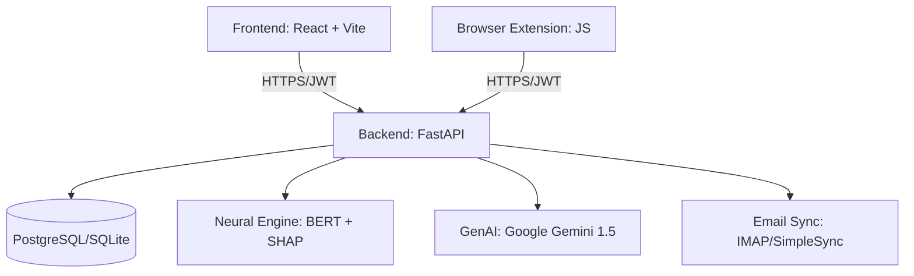

# 🛡️ PhishGuard AI: Advanced Neural Phishing Protection

PhishGuard AI is a state-of-the-art cybersecurity suite designed to protect users from the evolving landscape of phishing and social engineering attacks. By combining **Deep Learning (BERT)**, **Explainable AI (SHAP)**, and **Generative Intelligence (Gemini)**, PhishGuard provides real-time detection, deep threat analysis, and educational insights.

---

## 🚀 Key Features

### 1. **Neural Detection Engine**
*   **BERT-powered Analysis**: Utilizes a Bidirectional Encoder Representations from Transformers (BERT) model to understand the semantic context of messages, identifying subtle social engineering lures that simple keyword filters miss.
*   **Real-time Scanning**: Instant assessment of suspicious emails, URLs, and text fragments with high precision (94.2% accuracy).

### 2. **Neural Labs (Explainable AI)**
*   **SHAP Integration**: Transparently shows *why* a message was flagged by highlighting specific tokens and their contribution to the "Phish Score."
*   **AI Threat Breakdown**: Generates human-readable explanations of detected threats using Gemini-1.5-Flash, translating complex ML outputs into actionable security advice.

### 3. **Smart Chatbot (Cyber-Sentinel)**
*   **Hybrid Intelligence**: Seamlessly switches between Gemini-powered deep conversations and robust **Offline Intelligence** for 24/7 support.
*   **Specialized Knowledge**: Trained on phishing types (Spear, Whaling, Quishing), legal IPC sections, and general cybersecurity best practices.

### 4. **Browser Integration**
*   **Seamless Scanning**: A dedicated browser extension that allows users to scan text directly from their browser or link their Gmail/Outlook accounts for automated inbox monitoring.
*   **Threat Persistence**: Saves scan history to a personalized dashboard for long-term security tracking.

### 5. **Legal & Compliance Directory**
*   **IPC & IT Act Integration**: Provides context on relevant Indian laws (e.g., Section 66D for Personation) to help users understand the legal implications of phishing.

---

## 🏗️ System Architecture

PhishGuard AI follows a modern, decoupled architecture:

*   **Frontend**: A high-performance SPA built with React and Tailwind CSS, featuring glassmorphism design and micro-animations.
*   **Backend**: A secure FastAPI application handling authentication, data persistence, and ML orchestration.
*   **Intelligence Layer**: A modular service architecture for ML prediction, AI explainability, and chatbot logic.

---

## 🛠️ Technology Stack

| Layer | Technology |
| :--- | :--- |
| **Frontend** | React, Vite, Tailwind CSS, Framer Motion, Axios |
| **Backend** | Python, FastAPI, SQLAlchemy, Pydantic |
| **Database** | PostgreSQL (Prod), SQLite (Local) |
| **Machine Learning** | Transformers (BERT), SHAP, Scikit-learn, PyTorch/TensorFlow |
| **Generative AI** | Google Gemini 1.5 Flash API |
| **Auth** | OAuth2 with JWT (JSON Web Tokens) |
| **Deployment** | Docker, Render.com, Vercel/Netlify |

---

## 📦 Setup & Installation

### Prerequisites
*   Python 3.10+
*   Node.js 18+
*   Google Gemini API Key

### Backend Setup
1. Navigate to directory: `cd backend`
2. Install dependencies: `pip install -r requirements.txt`
3. Create `.env` file with `GEMINI_API_KEY`, `SECRET_KEY`, and `DATABASE_URL`.
4. Initialize database: `python seed_sqlite.py`
5. Start server: `uvicorn main:app --reload`

### Frontend Setup
1. Navigate to directory: `cd frontend`
2. Install dependencies: `npm install`
3. Create `.env` with `VITE_API_URL`.
4. Run development server: `npm run dev`

---

## 🛡️ Security & Compliance
*   **Data Privacy**: Personal email credentials and scan data are encrypted at rest.
*   **Secure Auth**: Implements bcrypt hashing for passwords and time-limited JWTs for session management.
*   **Origin Control**: Strict CORS policies to prevent unauthorized API access.

---

## 🗺️ Future Roadmap
1. **SMS Integration**: Extend detection to mobile SMS/Smishing via Twilio.
2. **Community Sourcing**: Allow users to report new phishing domains to a global shared database.
3. **Advanced Quishing**: Visual analysis of QR codes for malicious redirects.
4. **Enhanced Laws Database**: Full legal AI assistant for case-law research.

---
*Developed by the PhishGuard Engineering Team.*
